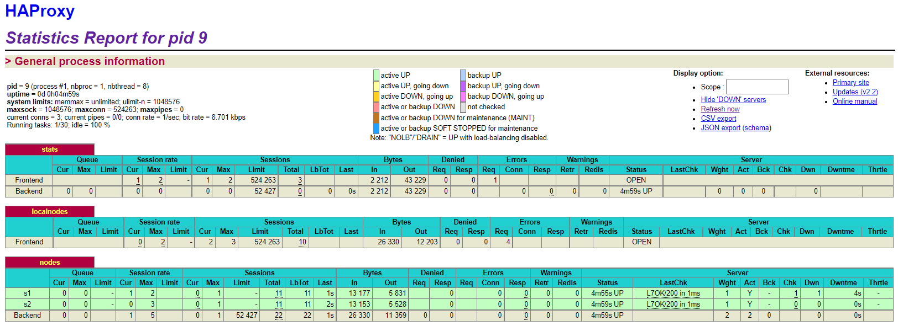
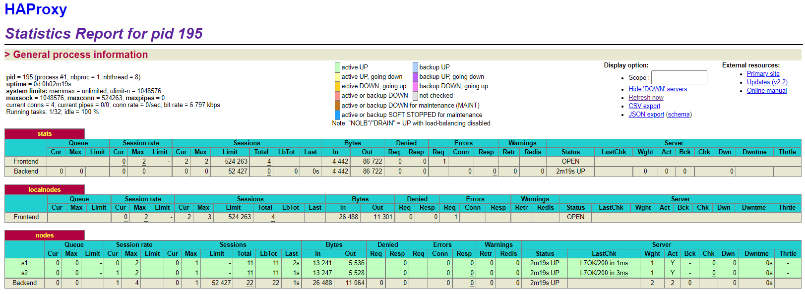

## Lab 04 - Docker

[toc]

### Introduction

Ce laboratoire a pour objectifs :

- De créer notre propre images Docker
- De se familiariser avec la supervision de processus légers pour Docker
- De comprendre les concepts de base pour la mise à l'échelle dynamique d'une application en production
- De mettre en pratique la gestion décentralisée des instances de serveur web

### Task 0: Identify issues and install the tools

1. **[M1]** Do you think we can use the current solution for a production environment? What are the main problems when deploying it in a production environment?

   > 

2. **[M2]** Describe what you need to do to add new `webapp` container to the infrastructure. Give the exact steps of what you have to do without modifiying the way the things are done. Hint: You probably have to modify some configuration and script files in a Docker image.

   > 

3. **[M3]** Based on your previous answers, you have detected some issues in the current solution. Now propose a better approach at a high level.

   > 

4. **[M4]** You probably noticed that the list of web application nodes is hardcoded in the load balancer configuration. How can we manage the web app nodes in a more dynamic fashion?

   > 

5. **[M5]** In the physical or virtual machines of a typical infrastructure we tend to have not only one main process (like the web server or the load balancer) running, but a few additional processes on the side to perform management tasks.

   For example to monitor the distributed system as a whole it is common to collect in one centralized place all the logs produced by the different machines. Therefore we need a process running on each machine that will forward the logs to the central place. (We could also imagine a central tool that reaches out to each machine to gather the logs. That's a push vs. pull problem.) It is quite common to see a push mechanism used for this kind of task.

   Do you think our current solution is able to run additional management processes beside the main web server / load balancer process in a container? If no, what is missing / required to reach the goal? If yes, how to proceed to run for example a log forwarding process?

   > 

6. **[M6]** In our current solution, although the load balancer configuration is changing dynamically, it doesn't follow dynamically the configuration of our distributed system when web servers are added or removed. If we take a closer look at the `run.sh` script, we see two calls to `sed` which will replace two lines in the `haproxy.cfg` configuration file just before we start `haproxy`. You clearly see that the configuration file has two lines and the script will replace these two lines.

   What happens if we add more web server nodes? Do you think it is really dynamic? It's far away from being a dynamic configuration. Can you propose a solution to solve this?

   > 

**Deliverables**:

1. Take a screenshot of the stats page of HAProxy at [http://192.168.42.42:1936](http://192.168.42.42:1936/). You should see your backend nodes.

   

2. Give the URL of your repository URL in the lab report.

   > https://github.com/danydacosta/Teaching-HEIGVD-AIT-2020-Labo-Docker

### Task 1: Add a process supervisor to run several processes

1. Take a screenshot of the stats page of HAProxy at [http://192.168.42.42:1936](http://192.168.42.42:1936/). You should see your backend nodes. It should be really similar to the screenshot of the previous task.

   

2. Describe your difficulties for this task and your understanding of what is happening during this task. Explain in your own words why are we installing a process supervisor. Do not hesitate to do more research and to find more articles on that topic to illustrate the problem.

   > Cette tâche ne nous a pas posé de difficultés, il faut juste être attentif à copier les configurations aux bons endroits dans les fichiers de configuration.
   >
   > Nous installons un process supervisor, mais ce n'est pas dans la philosophie Docker qui permet normalement d'avoir qu'un seul process par container, quand ce process meurt, le container meurt avec. Ce qui peut être contraignant dans certains cas. Nous mettons donc en place le système S6 afin de pouvoir exécuter plusieurs process dans un container.

### Task 2: Add a tool to manage membership in the web server cluster

1. Provide the docker log output for each of the containers: `ha`, `s1` and `s2`. You need to create a folder `logs` in your repository to store the files separately from the lab report. For each lab task create a folder and name it using the task number. No need to create a folder when there are no logs.

   > Les logs se trouve dans le dossier logs/task 2.

2. Give the answer to the question about the existing problem with the current solution.

   > Le problème avec la configuration actuelle c'est qu'il faut démarrer le container ha avant les containers s1 et s2 pour que ha les détectent comme il faut et les ajoute en tant que node. Si le container ha ne fonctionne pas ou plus alors cela peut être problématique car cela ne créera pas de cluster. Avec Serf il existe une solution qui permet que chaque nouveau node s'attache au dernier node créé. 

3. Give an explanation on how `Serf` is working. Read the official website to get more details about the `GOSSIP` protocol used in `Serf`. Try to find other solutions that can be used to solve similar situations where we need some auto-discovery mechanism.

   > Serf s'appuie sur le protocole GOSSIP qui est efficace et léger pour communiquer avec les nœuds. Les agents de Serf échangent périodiquement des messages entre eux, le premier nœud envoie un message à un autre nœud, ces deux nœuds envoient ensuite leurs messages à un autre nœud et ainsi de suite jusqu'à ce que tous les nœuds aient échangés leurs messages. Grace à ce protocole, Serf est capable de détecter rapidement les membres défaillants et d'en informer le reste du cluster, il s'appuie sur une technique de sondage aléatoire qui s'est avérée efficace pour les clusters de toute taille.
   >
   > Sur internet nous trouvons d'autres software comme ZooKeeper, qui est lui plus complexe que Serf, il ne peut être utilisé directement comme un outil mais il faudra utilisé des librairies pour implémenter les fonctionnalités. Un autre outil est Consul, qui utilise un serveur centralisé, contrairement à Serf. Consul s'inspire de la bibliothéque Serf pour la détection des membres et des échecs, mais fournit en plus des fonctionnalités de haut niveau.

### Task 3: React to membership changes

### Task 4: Use a template engine to easily generate configuration files

### Task 5: Generate a new load balancer configuration when membership changes

### Task 6: Make the load balancer automatically reload the new configuration

### Difficulties

### Conclusion
